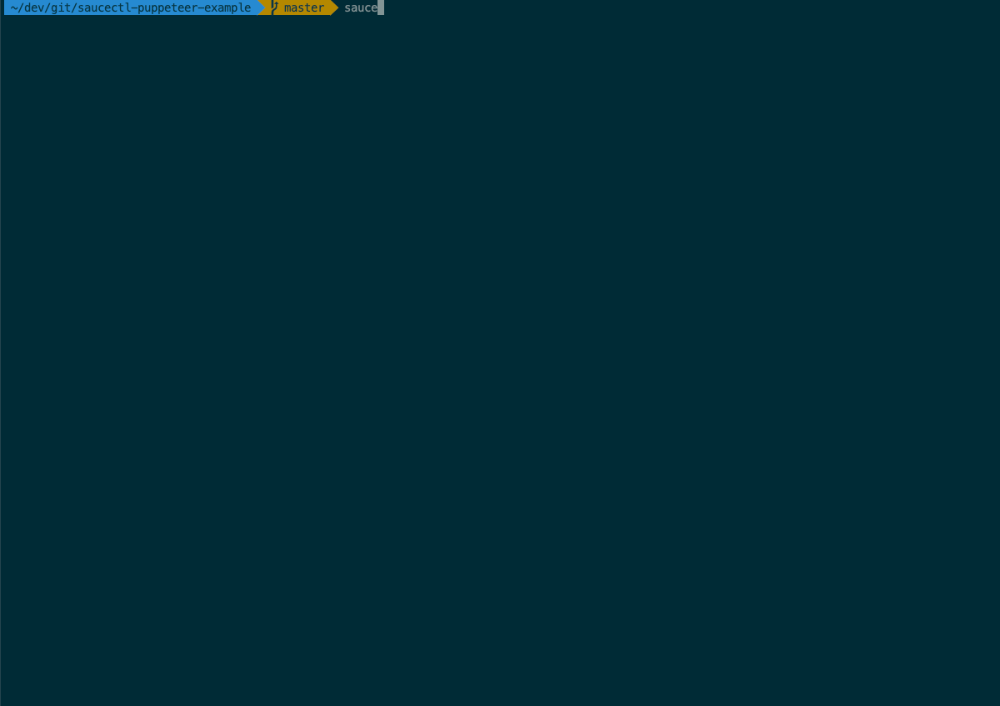

# saucectl puppeteer example

Example running saucectl with puppeteer.

## What You'll Need

Install `saucectl` and set up your Sauce Labs account by following
the [installation guide](https://docs.saucelabs.com/testrunner-toolkit/installation).

## Running The Examples

Simply check out this repo and run the appropriate command below :rocket:

### In Docker

```shell
saucectl run --test-env docker
```



### In Sauce Cloud

Puppeteer is currently *not* available in the Sauce Cloud.

## The Config

[Follow me](.sauce/config.yml) if you'd like to see how saucectl is configured for this repository. 
