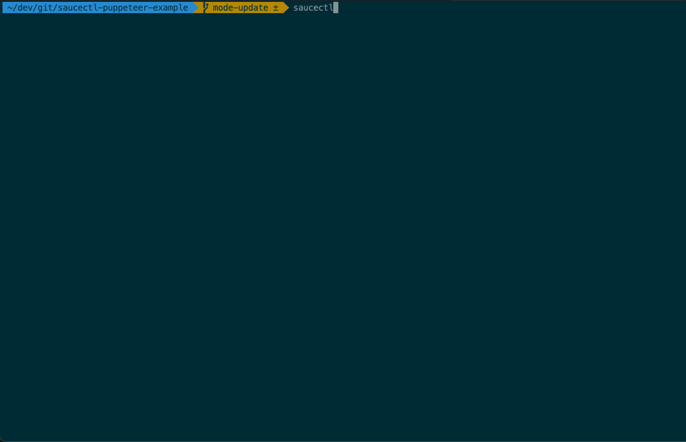

# saucectl puppeteer example

Example running saucectl with puppeteer.

## For your reference

* [Puppeteer API](https://github.com/puppeteer/puppeteer/blob/v10.2.0/docs/api.md)
* [Login test example](./tests/more.complex.test.js)

## What You'll Need

The steps below illustrate one of the quickest ways to get set up. If you'd like a more in-depth guide, please check out
our [documentation](https://docs.saucelabs.com/testrunner-toolkit/installation).

### Install `saucectl`

```shell
npm install -g saucectl
```

### Set Your Sauce Labs Credentials

```shell
saucectl configure
```

## Running The Examples

Simply check out this repo and run the command below :rocket:

```shell
saucectl run
```



> **NOTE** Puppeteer is currently *not* available in the Sauce Cloud.

## The Config

[Follow me](.sauce/config.yml) if you'd like to see how saucectl is configured for this repository. 

Our IDE Integrations (e.g. [Visual Studio Code](https://docs.saucelabs.com/testrunner-toolkit/ide-integrations/vscode)) can help you out by validating the YAML files and provide handy suggestions, so make sure to check them out!
